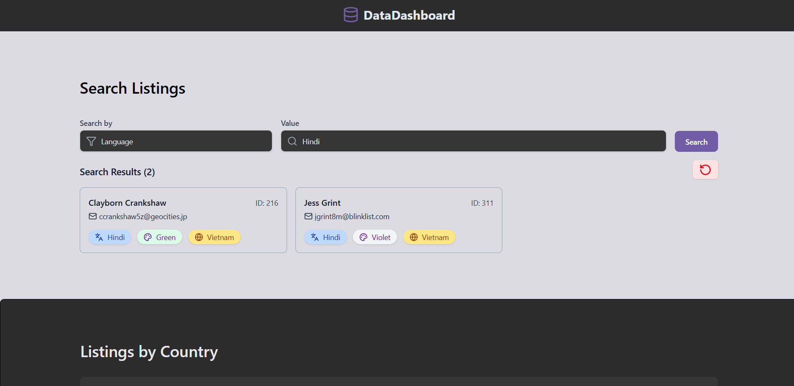
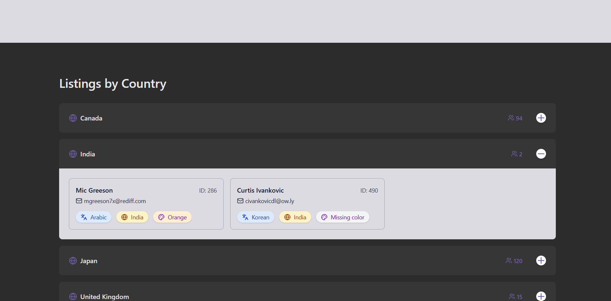
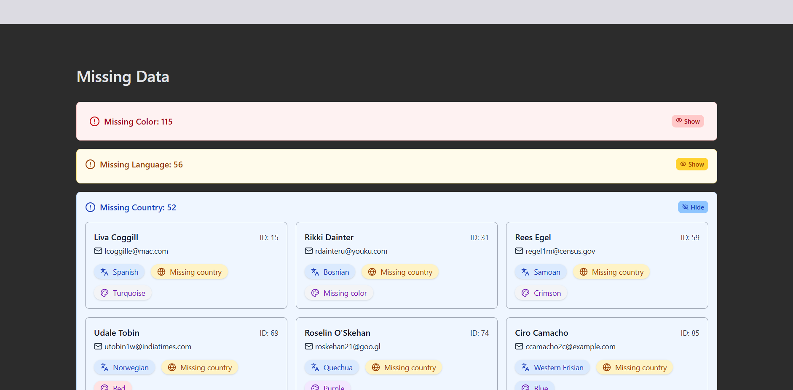

# WHERENESS Listings Dashboard


## 🧩 Features

- 🔍 **Search by Color or Language**
  - Filter user listings by a selected color or language input.
- 🌍 **Group Listings by Country**
  - All listings are neatly grouped by the user’s country with counts.
- 🚫 **Missing Field Detection**
  - View how many listings are missing a `color`, `country` or `language`, and see them listed.


## 🖼️ Screenshots

### 🔍 Search by Color or Language



### 🌍 Grouped by Country



### 🚫 Missing Data View




## 📁 File Structure

```

├── public/
├── src/
│   ├── components/        # Reusable UI components
│   ├── middleware/        # Data filtering and logic
│   ├── mock-data/         # JSON listings
│   ├── types/             # TypeScript interfaces
│   └── App.tsx            # Main UI entry point
├── README.md
├── package.json

````


## 🚀 Getting Started

### 1. Clone the repository

```bash
git clone https://github.com/Pallavikumarimdb/coding-take-home.git
````

### 2. Install dependencies

```bash
yarn install
```

### 3. Run the app locally

```bash
yarn dev
```

## 📦 Build for Production

```bash
yarn build
```

---
